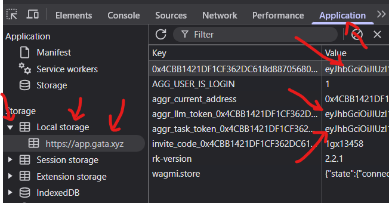

# 🤖 Gata Auto Bot

Automation bot for Gata Data Verification Agent (DVA) tasks. This bot helps automate the process of completing DVA tasks on the Gata platform.

## 📋 Features

- Automatic login with MetaMask credentials
- Auto-start DVA tasks
- Session maintenance
- Screenshot logging
- Activity simulation
- Configurable settings

## 🚀 Quick Start

1. Clone the repository:
```bash
git clone https://github.com/airdropinsiders/Gata-Auto-Bot.git
cd Gata-Auto-Bot
```

2. Install dependencies:
```bash
npm install
```

3. Configure your settings:
   - Copy `configs.json.example` to `configs.json`
   - Fill in your personal details:
     - `address`: Your wallet address
     - `bearer`: Your bearer token
     - `llm_token`: Your LLM token
     - `task_token`: Your task token
     - `invite_code`: Your invite code

4. Run the bot:
```bash
node index.js
```
## How to find Bearer Token and Others for configs.json

1. **F12 or Inspect Element**
   Go to Aplication - then Local Storage :
  
   

## ⚙️ Configuration

Create a `configs.json` file with the following structure:

```json
{
    "address": "YOUR_WALLET_ADDRESS",
    "bearer": "YOUR_BEARER_TOKEN",
    "llm_token": "YOUR_LLM_TOKEN",
    "task_token": "YOUR_TASK_TOKEN",
    "invite_code": "YOUR_INVITE_CODE"
}
```

## 📝 Requirements

- Node.js v14+
- npm or yarn
- Playwright
- Active Gata account with valid tokens

## Troubleshooting

Install essential build tools and libraries
```bash
sudo apt-get install -y \
    xvfb \
    libgbm-dev \
    libxkbcommon-x11-0 \
    libgtk-3-0 \
    libasound2 \
    libx11-xcb1 \
    libxcb1 \
    libxss1 \
    libnss3 \
    libxcomposite1 \
    libxcursor1 \
    libxdamage1 \
    libxi6 \
    libxtst6 \
    libatk1.0-0 \
    libatk-bridge2.0-0 \
    libpango-1.0-0 \
    libpangocairo-1.0-0 \
    libcups2 \
    libdrm2 \
    libxrandr2 \
    libgconf-2-4 \
    libc6 \
    ca-certificates \
    fonts-liberation \
    libappindicator3-1 \
    libasound2 \
    libatk-bridge2.0-0 \
    libatk1.0-0 \
    libgbm1 \
    libnspr4 \
    libnss3 \
    libxcb1 \
    xdg-utils
```
## Setting up Xvfb (X Virtual Frame Buffer)
For headless execution on systems without a display:

```bash
# Install Xvfb if not already installed
sudo apt-get install -y xvfb

# Run tests with Xvfb
xvfb-run --auto-servernum --server-args="-screen 0 1280x960x24" npm test
```

If you encounter permission issues:
```bash
# Fix npm permissions
sudo chown -R $(whoami) ~/.npm
sudo chown -R $(whoami) /usr/local/lib/node_modules
```

If Playwright browsers fail to install:
```bash
# Remove and reinstall Playwright browsers
rm -rf ~/.cache/ms-playwright
npx playwright install
```

## 🔍 Debugging

The bot maintains a current screenshot file (`current_screenshot.png`) for debugging purposes. In case of errors, check:
- The screenshot file
- Console output
- `dva-page-content.html` (generated if button detection fails)

## ⚠️ Important Notes

1. Keep your tokens and credentials secure
2. Do not share your `configs.json` file
3. The bot uses headless browser mode by default
4. Ensure stable internet connection

## 🤝 Support

Join our Telegram channel for support and updates:
[https://t.me/AirdropInsiderID](https://t.me/AirdropInsiderID)

## 📜 License

MIT License - see the [LICENSE](LICENSE) file for details

## ⚡️ Quick Tips

1. Ensure all tokens are up to date
2. Check your network connection if the bot fails to connect
3. Use PM2 or similar tools for continuous operation
4. Monitor the bot's activity through screenshots

## 🔐 Security

Never share your private keys or tokens. This bot only requires standard Gata authentication tokens, not your private keys.

---
Made with ❤️ by [Airdrop Insider](https://t.me/AirdropInsiderID)
